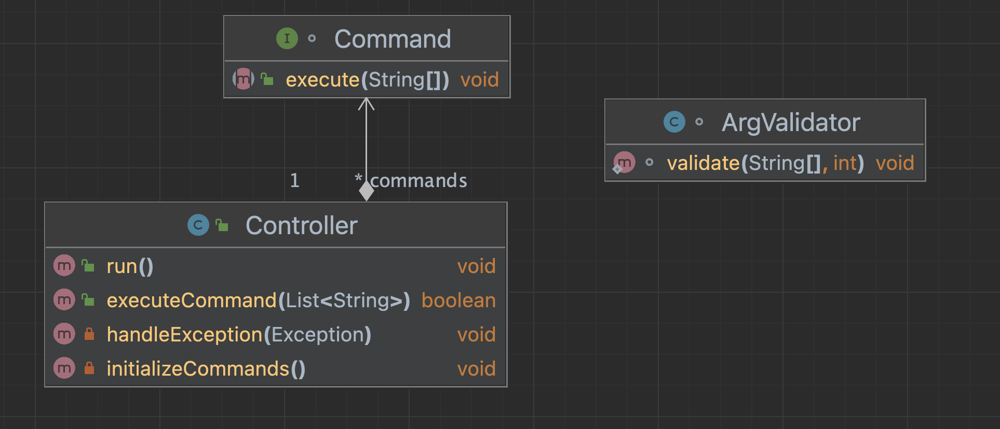

# MIME

This is a project for the course CS 5010: Program Design Paradigms at Northeastern University.

## Project Description

This project is a command-line image processing program. It will read in an image from a file, perform some operations on it, and write the result to another file.
Please see the [USEME.md](USEME.md) file for a detailed description of the program.
This program also supports reading from scripts containing a sequence of commands, and writing the results to files. The program will also support conventional file formats.

## How to run

### Prerequisites

- Java 11
- JUnit 4.x

### Running the program

This program supports three modes of operation, each triggered by specific command-line arguments. Below are the instructions for each:

Script File Execution Mode:

Use:

```bash
java -jar Program.jar -file [path-of-script-file]
```
Description: Executes a script file and then shuts down the program. Replace [path-of-script-file] with the actual path to your script file.
Interactive Text Mode:

Use:
```bash
java -jar Program.jar -text
```

Description: Opens the program in an interactive text mode, allowing the user to input and execute scripts line by line.
Graphical User Interface (GUI) Mode:

Use:
```bash
java -jar Program.jar
```


Description: Launches the program's graphical user interface. This mode is also activated by double-clicking the JAR file.
Invalid Arguments
If any command-line arguments other than the above are used, the program will display an error message and terminate.


## Using the GUI

The GUI is the default mode of operation for the program. It can also be launched by double-clicking the JAR file.


## Overview of the code

`ime` package contains the entire source code for the program. The `ime` package contains the following sub-packages:
model, CLIController, view.

This the high-level architecture diagram for the program:


### Model
The model is responsible for the data and the logic of the program.


### View
There are two views in the program: the command-line view and the script view. The command-line view is the default view. The script view is used when the user enters the `run-script` command.


### Controller

The CLIController is responsible for the communication between the model and the view. It is also responsible for the execution of the commands.



Every command is a class that implements the `Command` interface. The `Command` interface has a single method `execute()`. The `execute()` method is called by the CLIController when the user enters a command. The `execute()` method is responsible for executing the command and returning the result to the CLIController.


## Resource used
The image used in the program is a picture from Unsplash by photographer [Petr Slováček](https://unsplash.com/@grwood).

The link to the image is [here](https://unsplash.com/photos/a-lighthouse-on-top-of-a-hill-near-the-ocean-YrQuagwtEbM).

Under the Unsplash License, the image is free to use for any purpose.


## Design changes and justifications

- Added a new Interface for the controller
- Factory Methods to create controllers and views
- Configuration file to handle all the arguments passed to the program

- Added a CommandExecutor and AbstractController to handle command processing
  - The CommandExecutor handles command processing for all controllers, AbstractController provides 
  a common run mechanism and template method for input reading, and specific controllers only need to implement how they read their respective inputs.


## Parts of the program that are not complete

Everything is complete.
